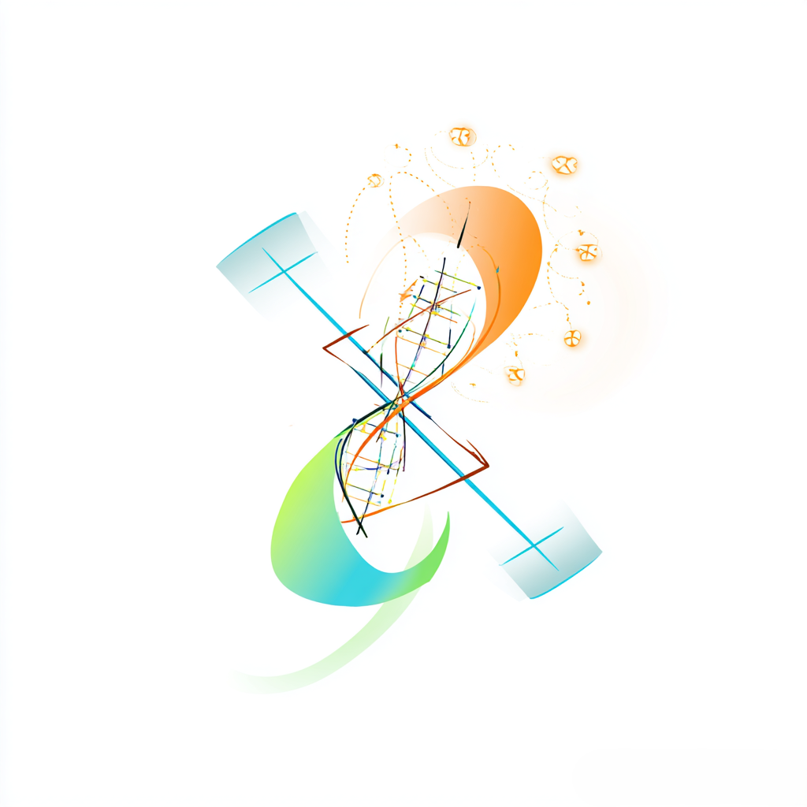

<!-- markdownlint-diable -->

# Nebula

 

    
    

    
    

    
    

    

 

<!-- markdownlint-restore -->

[简体中文](http://docs.nebula.istaroth.xin/zh-CN/) | [English](http://docs.nebula.istaroth.xin/en-US/)

Nebula

React + Rust，提供微纳米光子器件设计与系统设计解决方案

一款针对微纳米光子器件设计与系统设计提出的 EDA 平台

持续发电中 ☆*: .｡. o(≧▽≦)o .｡.:*☆

## 下载与安装

请阅读 [文档](http://docs.nebula.istaroth.xin/zh-CN/) 后前往 [官网](http://nebula.istaroth.xin) 或 [Release](https://github.com/IGIPME/Nebula/releases) 下载，并参考 [新手上路](http://docs.nebula.istaroth.xin/zh-CN/) 进行安装。

## 亮点功能

- 支持 Python, Rust 等多种接口，方便自动化集成

## 使用说明

### 功能介绍

请参阅 [用户手册](http://docs.nebula.istaroth.xin/zh-CN/)。

### CLI 支持

Nebula 支持命令行界面（CLI）操作，支持 Linux 和 Windows，可用于自动化脚本。请参阅 [CLI 使用指南](http://docs.nebula.istaroth.xin/zh-CN/)

### 仿真支持

Nebula 支持 ANSYS Lumerical、Meep 仿真。请参阅 [仿真指南](http://docs.nebula.istaroth.xin/zh-CN/)

- **ANSYS Lumerical：** 通过 `grpcio` 构建的 gRPC 服务器进行仿真集成，服务端封装 `ansys/pylumerical`。

## 加入我们

### 主要关联项目

- [Nebula 文档站](https://github.com/IGIPME/Nebula-Doc)

### 多语言（i18n）

Nebula 以中文（简体）为第一语言，翻译词条均以中文（简体）为准。

### 参与开发

请参阅 [开发指南](http://docs.nebula.istaroth.xin/zh-CN/)。

### API

请参阅 [协议文档](http://docs.nebula.istaroth.xin/zh-CN/)

## 致谢

### 贡献/参与者

感谢所有参与到开发/测试中的朋友们，是大家的帮助让 Nebula 越来越好！

## 声明

- 本软件开源、免费，仅供学习交流使用。